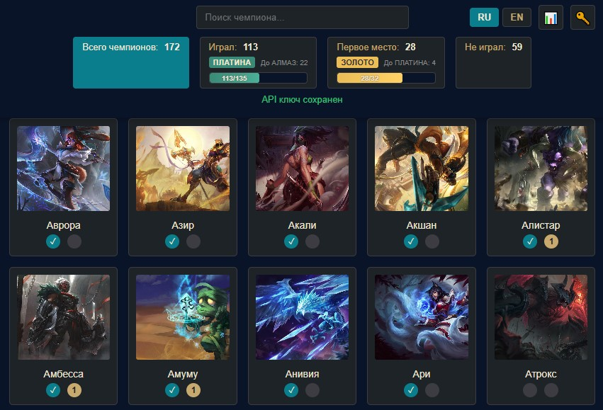

# Arena Champion Challenges Tracker

A Windows desktop app for tracking League of Legends **Arena** champion progress: mark champions you've played and those you've won with, follow challenge ranks, and optionally import stats from the Riot Games API.

## Why this exists

In **Legacy → Challenges**, League of Legends has two Arena progressions that track unique champions:

| In-game challenge | What it tracks |
|-------------------|----------------|
| **Arena Champion Ocean** — *Play Arena games with different champions* | Champions you've played at least one Arena game with |
| **Adapt to All Situations** (*Arena God*) — *Place first in Arena games with different champions* | Champions you've finished 1st with |

The client only shows your tier and total count for each — not **which** champions count. During champion select you can't see who you still need for either challenge.

This app shows the full roster, filters (played / first place / not played), challenge rank progress, and optional import from match history via the Riot API.

<p align="center">
  
</p>

## Features

- Champion grid with images loaded from Riot Data Dragon
- Manual tracking: mark champions as **played** (✓) or **first place** (1)
- Click a champion portrait to cycle through states (not played → played → first place → not played)
- Filters: all, played, first place, not played
- Search champions by name
- Arena challenge ranks (Iron → Master) with progress bars for:
  - unique champions played
  - unique champions with a first-place finish
- Import match history from the Riot Games API (Arena matches since February 7, 2024)
- RU / EN interface
- Progress saved between sessions

## Usage

### Manual tracking

- Click **✓** to toggle whether you have played a champion
- Click **1** to toggle a first-place finish (also marks the champion as played)
- Click the champion portrait to cycle: not played → played → first place → not played
- Click stat counters in the header to filter the grid
- Use the search box to find champions quickly

### Import from Riot API

1. Get a personal API key from [developer.riotgames.com](https://developer.riotgames.com/)
2. Click the **🔑** button and save your key
3. Click the **📊** button, enter summoner name, tag, and region, then fetch data

## Development

### Prerequisites

- [Node.js](https://nodejs.org/) (LTS)
- Android builds: [Android Studio](https://developer.android.com/studio) with SDK and JDK

### Run from source

```bash
git clone https://github.com/anvirq/arena-champion-tracker.git
cd arena-champion-tracker
npm install
npm start
```

### Build Windows

```bash
npm run build              # installer + portable → dist/
npm run build:installer    # NSIS setup only
npm run build:portable     # portable .exe only
```

### Build Android

First-time setup:

```bash
npm run android:prepare
```

Day-to-day development:

```bash
npm run android:dev
```

Full pipeline (web assets, copy, setup, icons, open Android Studio):

```bash
npm run cap:build
```

| Script | Description |
|--------|-------------|
| `npm run build:web` | Build web assets into `www/` |
| `npm run cap:copy` | Copy web assets to the Android project |
| `npm run cap:icons` | Generate Android launcher icons |
| `npm run cap:open` | Open the project in Android Studio |


## Tech Stack

- Electron + electron-builder (Windows desktop)
- Capacitor (Android)
- Riot Data Dragon (champion data and images)
- Riot Games API (match history)

## Disclaimer

This project is not endorsed by Riot Games. League of Legends and all related properties are trademarks of Riot Games, Inc.
